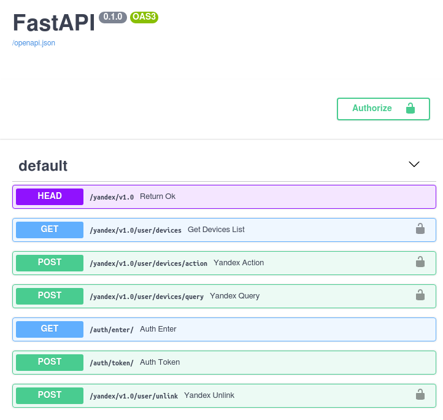

### Yandex Алиса + FastAPI

Очередной, 100500, шлюз Алисы для любителей DIY + IoT + Python.

Задача была простая - *дополнительный* канал управления домашним светом (и не только) с помощью Алисы. Ставить что-то тяжелое вроде Home Assistant или на Node.js совсем не хотелось. У меня уже была небольшая домашняя инфраструктура живущая на Raspberry Pi 4 + Node Red + MQTT Broker + 433Mhz передатчик, который рулил домашними девайсами (всякие разные реле которые умеют отзываться на 433Mhz). Вот тут на арену выходит FastAPI который оказался очень крутым для решения подобных (и не только) задач.

Что умеет:
- проходить весь процесс авторизации который требует Яндекс для работы платформы умного дома (OAuth2)
- отдавать базу всех девайсов описанную в файле devices.py (`/yandex/v1.0/user/devices`)
- отдавать текущий статус устройства (`/yandex/v1.0/user/devices/query`)
- ну и собственно рулить устройствами (`/yandex/v1.0/user/devices/action`)

Т.к. это только один из модулей всей инфраструктуры, все что он делает - отвечает на запросы текущим состоянием девайса из REDIS, а на экшены шлет топик в MQTT, который уже подхватывает другой микро сервис и делает оставшуюся магию :) Т.к. в распоряжении у меня только самые простые устройства (свет on/ff, RGB лента и несколько датчиков) то логика описана для них, остальное уже допишите сами под свои хотелки. 

Как то так:

За всеми остальными подробностями - уже в [Яндекс](https://yandex.ru/dev/dialogs/alice/doc/smart-home/concepts/general-concept.html)

p.s. Сам демон крутится под [Unit](https://unit.nginx.org/) который живет за Nginx где хранятся все SSL сертификаты без которых с вами Яндекс даже разговаривать не начнет :)
